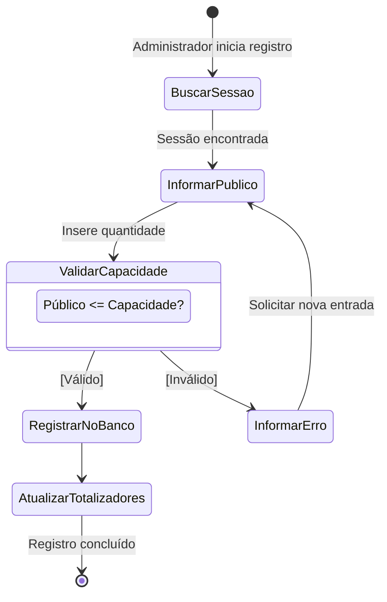
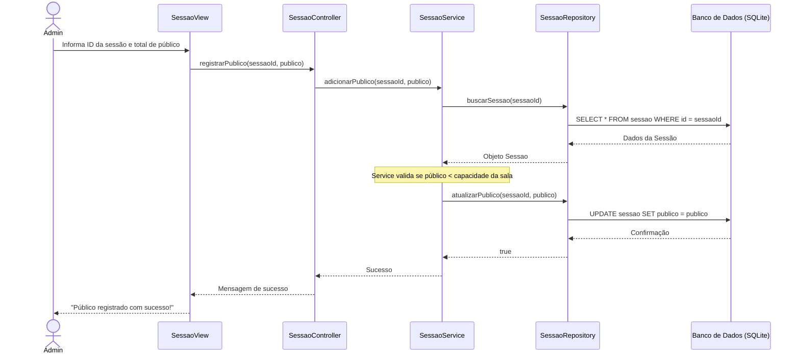

## 📌 1. Levantamento de Requisitos e Regras de Negócio

### Requisitos Funcionais (RF)
* **RF01:** O sistema deve permitir o cadastro e gerenciamento de cinemas (endereço e capacidade total).
* **RF02:** O sistema deve permitir o cadastro de filmes (título, duração, diretor, elenco, gênero).
* **RF03:** O sistema deve permitir a alocação de filmes em sessões por cinema.
* **RF04:** O sistema deve permitir o registro diário do público presente em cada sessão.
* **RF05:** O sistema deve calcular e exibir a totalização de público por sessão, por filme e por cinema.
* **RF06:** O sistema deve permitir a consulta dos filmes em cartaz e suas informações.

### Regras de Negócio (RN)
* **RN01:** O intervalo de tempo entre duas sessões na mesma sala deve respeitar o tempo de limpeza (ex: 30 minutos).
* **RN02:** O público registrado em uma sessão não pode ultrapassar a capacidade máxima da sala.
* **RN03:** Um filme só pode ser colocado em cartaz se possuir todas as informações obrigatórias.

---

## 📊 2. Modelagem UML (Diagramas)

### A. Diagrama de Casos de Uso
```mermaid
flowchart LR
    %% Atores
    Admin([Administrador])
    Espectador([Espectador])

    %% Sistema e Casos de Uso
    subgraph "Sistema Rede de Cinemas"
        direction TB
        UC1([Gerenciar Cinemas])
        UC2([Gerenciar Filmes])
        UC3([Gerenciar Sessões])
        UC4([Registrar Público Diário])
        UC5([Gerar Relatórios de Público])
        UC6([Consultar Filmes em Cartaz])
    end

    %% Relacionamentos
    Admin --> UC1
    Admin --> UC2
    Admin --> UC3
    Admin --> UC4
    Admin --> UC5

    Espectador --> UC6
  ```

```mermaid
classDiagram
    class Cinema {
        -String nome
        -String endereco
        -int capacidadeTotal
    }

    class Sala {
        -int numero
        -int capacidadeMaxima
    }

    class Filme {
        -String titulo
        -int duracaoMinutos
        -String genero
        -String diretor
        -String elenco
    }

    class Sessao {
        -DateTime dataHoraInicio
        -DateTime dataHoraFim
        -int publicoRegistrado
    }

    Cinema "1" -- "*" Sala : possui
    Sala "1" -- "*" Sessao : abriga
    Filme "1" -- "*" Sessao : exibido em

```




